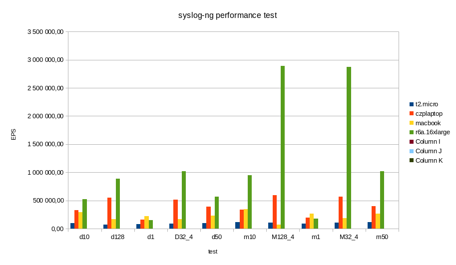

# sngbench

Shell script to performance test your syslog-ng.

# Contents

* [About](#about)
* [License](#license)
* [History](#history)
* [Prerequisites](#prerequisites)
* [How to get it](#how-to-get-it)
* [Files](#files)
* [Before you begin](#before-you-begin)
* [Running the script](#running-the-script)
* [Configuration files](#configuration-files)
* [Output](#output)

# License

This project is licensed under the MIT license. For further details, please see [`LICENSE`](LICENSE).

# About

```sngbench.sh``` is a shell script that runs from localhost and uses ```loggen```, the bundled benchmarking and testing tool of syslog-ng. It comes with two configurations: a performance-optimized and a realistic. You are free to extend it with your configurations.

# History

The original idea of this script came many years ago, when Peter Czanik got access to various interesting platforms, such as ARM, POWER, RiscV, and even MIPS. To compare these, he wrote a quick and dirty script. The main goal was CPU comparison, so loggen runs were short to avoid disk I/O.

Many people got interested in it, but the script was ugly and difficult to use. So, with the help of [István Szántai](https://github.com/szantaii), the code was refactored, and developed into something easy to read and use. It is no longer limited to short runs, values are not hard-coded, and it is a single script run instead of four different script runs.

# Prerequisites

Operating system: tested on Linux, FreeBSD and MacOS, where syslog-ng is regularly tested.

You need a recent version of the ```bash``` shell installed (```pkg install bash``` on FreeBSD, ```brew install bash``` on the Mac), ```coreutils``` (```brew install coreutils``` on MacOS), and ```syslog-ng``` available in the ```PATH```.

You also need ```git``` to download the script and its configuration.

# How to get it

In a directory that does not have a sub-directory called ```sngbench```, run:

```
git clone https://github.com/czanik/sngbench
```

# Files

 * ```conf``` directory: syslog-ng configuration files
 * ```out``` directory: save location of measurement results, also includes examples
 * ```input.txt``` file: describes the list of tests
 * ```sngbench.sh``` file: script to run the benchmarks

# Before you begin

Before you run ```sngbench.sh``` make sure that nothing blocks it. The script starts ```syslog-ng``` with configuration files not in the standard directories, and opens multiple network ports. During the time of testing:

 * disable the firewall (or make sure that TCP ports 514-517 are available from the localhost)
 * disable ```SELinux``` or ```AppArmor``` because they can block syslog-ng from accessing the configuration files and even from opening network ports

Make sure that nothing blocks TCP port 514-517. The script stops syslog-ng from running before running the tests, but it does not check if the ports are available. If you have rsyslog or another syslog implementation, stop them before running the tests.

When you run the script, you might see warnings about configuration version mismatches.

# Running the script

```sngbench.sh```must run as ```root``` and expects conf/out/input.txt to be in the current directory. On MacOS you need to set the PATH to make sure that the new bash and syslog-ng are found:
```
export PATH=/usr/local/bin/:/usr/local/sbin/:$PATH
```

To start the script:

```
./sngbench.sh
```

Or, to have a more verbose (debug) output:

```
bash -x sngbench.sh
```

# Configuration files

## conf directory

This file contains the syslog-ng configurations used by the script. By default it contains two configuration files:

 * ```czp_maxperf``` is a performance-tuned configuration. It opens four TCP ports.
 * ```czp_distro``` is a more realistic configuration based on the default syslog-ng configuration in openSUSE. It removes collecting local log messages and adds a tcp() source.

Both configurations store logs in the file ```/var/log/fromnet1``` (the maxperf configuration also creates files ending 2, 3, 4). The script automatically deletes these files after each loggen run.

You can add your own test configuration files here.

You might want to edit the version string in the configuration files to match the installed syslog-ng version.

## input.txt

This file controls which configuration file is tested and which loggen parameters are used.

Each line starts with the configuration file name, followed by one or more blocks describing loggen parameters to use. This way you can start multiple loggen clients with various port numbers.

Examples:

```
czp_maxperf,-i -r 3000000 --active-connections=128 -S -C 127.0.0.1 514,-i -r 3000000 --active-connections=128 -S -C 127.0.0.1 515,-i -r 3000000 --active-connections=128 -S -C 127.0.0.1 516,-i -r 3000000 --active-connections=128 -S -C 127.0.0.1 517
czp_distro,-i -r 3000000 --active-connections=1 -S -C 127.0.0.1 514,

```

You can completely replace this file, or append your own rules to the file.

When you write your own rules, make sure that the combination of the configuration name and the loggen parameters are unique. Output file names are based on the combination of the configuration name and the loggen parameters, and are overwritten if not unique (as we discovered after half a decade in a long debugging session :-) ).

# Output

The output of the script is saved under the ```out``` directory. Each time you start the script, it creates a new directory based on the current date and time.

In this directory you can find the following files:

 * ```uname``` gives information about the system where the script is run
 * ```syslog-ng.version``` gives you syslog-ng version information, the output of ```syslog-ng -V```
 * ```os-release``` on Linux gives you extra information about the distribution usedin
 * ```cpuinfo``` on Linux gives you extra information about the CPU running the script

The scripts runs all tests defined in ```input.txt``` three times. Results from each run are saved into different directories. In each directory, you can find files corresponding to lines in the input.txt. The filename contains the configuration name, the loggen parameters, the number of runs (usually '1', except if multiple loggen clients were running in parallel). The extension of the file is .csv, even if the file does not fully conform to the CSV specification (the most important line, the final result, is not CSV).

The most important file in the directory ```results.csv```, which contains the results of the three runs.


